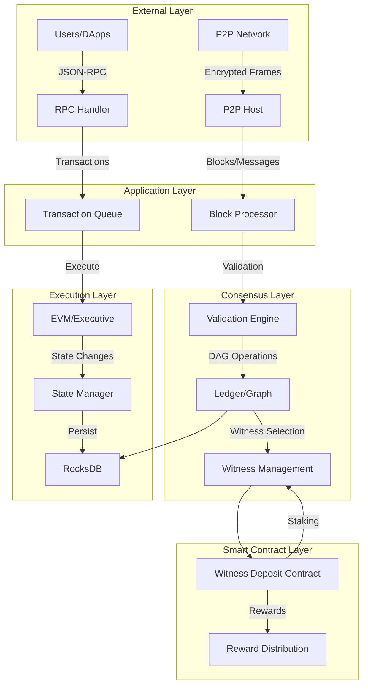
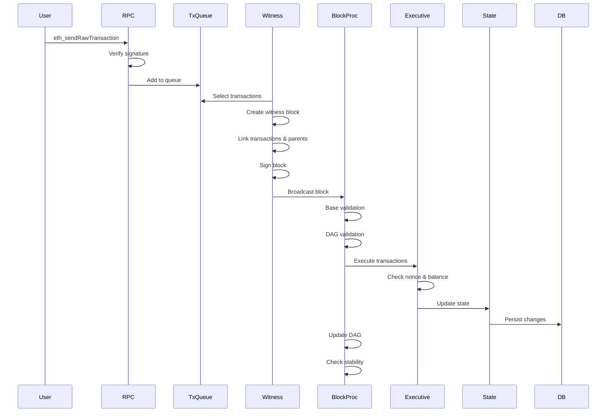
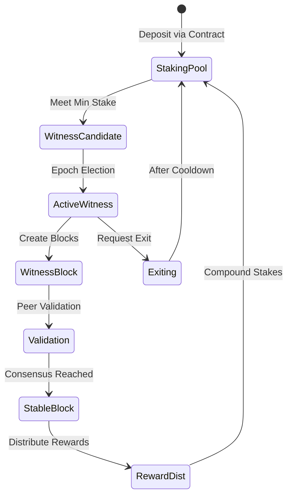

# Olympus Blockchain - Security Architecture Analysis

## Executive Summary

Olympus is a DAG-based (Directed Acyclic Graph) blockchain implementation written in C++ that serves as the blockchain layer for the Oort ecosystem. It features:
- **Consensus**: Witness-based consensus with epoch-based election
- **EVM Compatibility**: Full Ethereum Virtual Machine support (upgraded to Shanghai)
- **Network**: Custom P2P protocol with encrypted handshaking
- **Smart Contracts**: System contracts for witness staking and governance

**Risk Assessment**: MEDIUM-HIGH
- Complex DAG consensus creates unique attack surfaces
- Witness election mechanism is critical for security
- EVM implementation requires constant security updates
- P2P layer has history of attack vulnerabilities

---

## 1. System Architecture

### 1.1 High-Level Overview

### 1.2 Core Components

#### **Consensus (mcp/consensus/)**
- **validation.cpp**: Block validation logic, signature verification, DAG structure validation
- **ledger.cpp**: DAG operations, witness management, stability determination

#### **P2P Networking (mcp/p2p/)**
- **handshake.cpp**: ECDH-based encrypted handshaking
- **host.cpp**: Peer management and connection handling
- **peer.cpp**: Individual peer state and communication

#### **EVM Execution (mcp/node/evm/, libinterpreter/)**
- **Executive.cpp**: Transaction execution engine
- **VM.cpp**: Virtual machine implementation
- **Precompiled.cpp**: Precompiled contract implementations

#### **Transaction Management (mcp/core/)**
- **transaction.cpp**: Transaction structure and signature verification
- **transaction_queue.hpp**: Pending transaction pool
- **block_processor.cpp**: Block processing pipeline

#### **State Management**
- **overlay_db.cpp**: State overlay for transaction execution
- **chain_state.cpp**: Blockchain state management

---

## 2. Data Flow Analysis

### 2.1 Transaction Flow

### 2.2 Block Validation Flow

**Base Validation** (`validation.cpp:base_validate`):
1. Check if block exists (replay protection)
2. Verify parent ordering and inclusion of previous
3. **Signature verification** (CRITICAL: uses `dev::recover`)
4. Verify sender matches signature

**DAG Validation** (`validation.cpp:dag_validate`):
1. Check previous block from same sender
2. Verify all parents exist and timestamps
3. **Validate links** (transaction nonces must be sequential)
4. Verify approves exist
5. **Check witness eligibility** for current epoch
6. Validate parent relationships (non-related)
7. Verify best parent and majority witness
8. **Validate last stable block** (critical for finality)

### 2.3 Witness Selection & Consensus

---

## 3. Security Model

### 3.1 Trust Boundaries

| Boundary | Trust Level | Components | Risk |
|----------|-------------|------------|------|
| External Users | **Zero Trust** | RPC, P2P | HIGH - All inputs validated |
| Witness Nodes | **Partial Trust** | Consensus, Block Creation | MEDIUM - Byzantine fault tolerant |
| Smart Contracts | **Conditional Trust** | EVM, System Contracts | HIGH - Reentrancy, logic bugs |
| Cryptographic | **High Trust** | secp256k1, ECDH | LOW - Standard libraries |
| Database | **Full Trust** | RocksDB | LOW - Persistence layer |

### 3.2 Attack Surface Analysis

#### 3.2.1 Network Attack Surface
**Components**: P2P handshake, frame encoding, peer management
**Threats**:
- MITM attacks during handshake
- DoS via malformed packets
- Eclipse attacks (isolating nodes)
- Sybil attacks (fake peer IDs)

**Mitigations**:
- ECDH encryption for handshake
- Packet size limits
- Peer reputation system
- Connection limits

#### 3.2.2 Consensus Attack Surface
**Components**: Witness election, block validation, DAG operations
**Threats**:
- Long-range attacks (rewriting DAG history)
- Selfish mining by witnesses
- Stake grinding attacks
- Witness collusion (51% attack variant)

**Mitigations**:
- Checkpointing via last_stable_block
- Economic penalties for misbehavior
- Witness majority requirements
- Epoch-based rotation

#### 3.2.3 Smart Contract Attack Surface
**Components**: EVM execution, system contracts, precompiled contracts
**Threats**:
- Reentrancy attacks
- Integer overflow/underflow
- Gas manipulation
- Delegatecall vulnerabilities

**Mitigations**:
- ReentrancyGuard on system contracts
- Shanghai EVM upgrade (better safety)
- Gas limit enforcement
- Careful contract design

#### 3.2.4 Transaction Processing Attack Surface
**Components**: Transaction queue, nonce management, signature verification
**Threats**:
- Front-running
- Transaction replay
- Nonce manipulation
- Signature malleability

**Mitigations**:
- Chain ID in signatures (EIP-155)
- Nonce ordering enforcement
- Low-s signature requirement
- Transaction ordering by witnesses

---

## 4. Cryptographic Security

### 4.1 Signature Scheme
- **Algorithm**: ECDSA over secp256k1
- **Implementation**: Bitcoin's libsecp256k1
- **Usage**: 
  - Transaction signatures
  - Block signatures
  - P2P handshake authentication

**Security Considerations**:
- ✅ Uses standard, audited library
- ✅ Enforces low-s signatures (mallleability protection)
- ✅ Chain ID prevents replay attacks
- ⚠️ Signature verification in multiple paths - must be consistent

### 4.2 P2P Encryption
- **Handshake**: ECDH key agreement
- **Frame Encryption**: AES-256 CTR mode
- **MAC**: HMAC for message authentication

**Security Considerations**:
- ✅ Uses ephemeral keys per session
- ✅ Mutual authentication
- ⚠️ No perfect forward secrecy rotation
- ⚠️ Handshake timeout vulnerabilities (fixed in history)

### 4.3 Key Management
- **Storage**: Encrypted keystore (V3 format)
- **Derivation**: scrypt for key derivation
- **Protection**: Password-based encryption

---

## 5. Threat Model

### 5.1 Threat Actors

| Actor | Capability | Motivation | Risk Level |
|-------|-----------|------------|------------|
| **External Attacker** | Network access, DoS | Financial gain, disruption | HIGH |
| **Malicious Witness** | Block creation, transaction censoring | Double-spend, censorship | MEDIUM |
| **Smart Contract Exploiter** | Code execution, state manipulation | Fund theft | HIGH |
| **Nation State** | Eclipse, traffic analysis | Surveillance, censorship | LOW-MEDIUM |
| **Insider** | Code modification, key access | Backdoor, theft | LOW |

### 5.2 Key Threats

#### T1: Consensus Manipulation
**Scenario**: Malicious witnesses collude to rewrite DAG history
**Impact**: Double-spending, transaction reversal
**Likelihood**: LOW (requires significant stake)
**Mitigation**: Last stable block checkpointing, economic penalties

#### T2: Smart Contract Exploits
**Scenario**: Reentrancy or logic bug in witness deposit contract
**Impact**: Unauthorized fund withdrawal, witness manipulation
**Likelihood**: MEDIUM
**Mitigation**: Contract audits, ReentrancyGuard, testing

#### T3: P2P Network Attacks
**Scenario**: DoS via malformed packets or eclipse attacks
**Impact**: Network partition, consensus failure
**Likelihood**: MEDIUM (history of P2P fixes)
**Mitigation**: Packet validation, rate limiting, peer diversity

#### T4: Transaction Front-Running
**Scenario**: Witness observes pending transactions and front-runs them
**Impact**: MEV extraction, user financial loss
**Likelihood**: HIGH
**Mitigation**: Transaction ordering rules, encrypted mempools (future)

#### T5: State Corruption
**Scenario**: Inconsistent state due to race conditions or bugs
**Impact**: Chain halt, incorrect balances
**Likelihood**: LOW
**Mitigation**: Transaction serialization, database atomicity

### 5.3 Security Assumptions

1. **Cryptographic**: secp256k1 and AES-256 are secure
2. **Majority Honest**: >50% of stake is held by honest witnesses
3. **Network**: Internet is not fully controlled by adversary
4. **Code**: Dependencies (Boost, RocksDB) are not backdoored
5. **Time**: Nodes have reasonably synchronized clocks

---

## 6. Previous Security Incidents

Analysis of git history reveals several security fixes:

### 6.1 P2P Vulnerabilities (commits 4f21d482, 09084e45, 1f56fc72)
- **Issue**: P2P attacks, handshake socket dump, UDP unknown packet type
- **Impact**: DoS, connection failures
- **Fix**: Enhanced packet validation, thread safety improvements

### 6.2 Synchronization Issues (commit 10bdeb62, commit eaad8979)
- **Issue**: Transaction queue and sync assertion failures
- **Impact**: Node crashes, sync failures
- **Fix**: Queue management improvements, locking fixes

### 6.3 Contract Issues (commits 8bebe6a9, b9143294)
- **Issue**: Contract initialization bugs, Stake event emission
- **Impact**: Incorrect state, event inconsistencies
- **Fix**: Contract logic corrections

### 6.4 Gas Fork Issues (commit 00f895cc)
- **Issue**: Gas calculation inconsistencies
- **Impact**: Consensus splits
- **Fix**: Harmonized gas calculations

---

## 7. Security Recommendations

### 7.1 Immediate Actions

1. **Audit System Contracts**: The witness deposit contract handles significant value and voting power
2. **Fuzz P2P Layer**: History shows vulnerabilities - continuous fuzzing needed
3. **Review DAG Stability Logic**: Complex last_stable_block logic is critical for finality
4. **Transaction Ordering**: Document and enforce fair ordering to prevent MEV

### 7.2 Medium-Term Improvements

1. **Formal Verification**: DAG consensus logic should be formally verified
2. **Bug Bounty Program**: Incentivize external security research
3. **Monitoring & Alerting**: Real-time detection of consensus anomalies
4. **Incident Response Plan**: Documented procedures for security incidents

### 7.3 Long-Term Strategy

1. **Zero-Knowledge Proofs**: Privacy-preserving transactions
2. **Quantum Resistance**: Plan migration to post-quantum cryptography
3. **Decentralization Metrics**: Monitor and improve decentralization
4. **Cross-Chain Security**: If bridges are added, rigorous security needed

---

## 8. Compliance & Standards

### 8.1 Alignment with Best Practices
- ✅ **EIP-155**: Replay protection via chain ID
- ✅ **EIP-1967**: Proxy pattern in system contracts  
- ⚠️ **Key Management**: Could benefit from BIP-32/39 HD wallets
- ❌ **Formal Specification**: No formal specification of consensus

### 8.2 Audit Trail
- Code review processes not visible in repo
- No public audit reports referenced
- Test coverage unclear (test/ directory exists but coverage unknown)

---

## 9. Dependencies & Supply Chain

### 9.1 Critical Dependencies
| Dependency | Version | Security Status | Risk |
|-----------|---------|-----------------|------|
| **Boost** | 1.81.0 | Generally secure | LOW |
| **RocksDB** | 8.3.3 | Active maintenance | LOW |
| **secp256k1** | Bitcoin fork | Well-audited | LOW |
| **libdevcore** | Custom | Unknown | MEDIUM |
| **evmc** | Submodule | Community-maintained | LOW-MEDIUM |

### 9.2 Supply Chain Risks
- Custom cryptographic code in `libdevcrypto` - needs audit
- P2P implementation is custom - attack surface
- System contracts deployed via bytecode - verify build reproducibility

---

## 10. Monitoring & Detection

### 10.1 Recommended Metrics
- **Consensus**: Block production rate, witness participation, reorg depth
- **Network**: Peer count, connection failures, packet drop rate
- **Transactions**: Queue depth, invalid tx rate, gas price distribution
- **State**: Account balance changes, contract interactions, state root consistency

### 10.2 Alerting Thresholds
- 🚨 **Critical**: Witness below 50% participation, deep reorg (>10 blocks), state root mismatch
- ⚠️ **Warning**: High transaction failure rate, p2p connection drops, unusual gas usage
- ℹ️ **Info**: New witness registration, large stakes, unusual contract deployments

---

## Appendix A: Glossary

- **DAG**: Directed Acyclic Graph - block structure allowing parallel blocks
- **Witness**: Authorized block producer selected via staking
- **MCI**: Main Chain Index - sequential numbering of main chain blocks
- **Epoch**: Time period for witness election and rewards
- **Last Stable Block**: Most recent block considered finalized
- **Link**: Transaction reference included in witness block
- **Approve**: Witness election proof message

## Appendix B: References

- [Yellow Paper](https://resources.computecoin.com/docs/computecoin-consensus-and-security.pdf): Consensus specification
- [Witness Deposit Contract](https://github.com/oort-tech/deposit-contract/releases/tag/v1.0.0): System contract source
- [Ethereum Yellow Paper](https://ethereum.github.io/yellowpaper/paper.pdf): EVM specification

---

**Document Version**: 1.0  
**Date**: 2025-11-10  
**Audit Type**: Comprehensive Security Architecture Review  
**Classification**: Public
